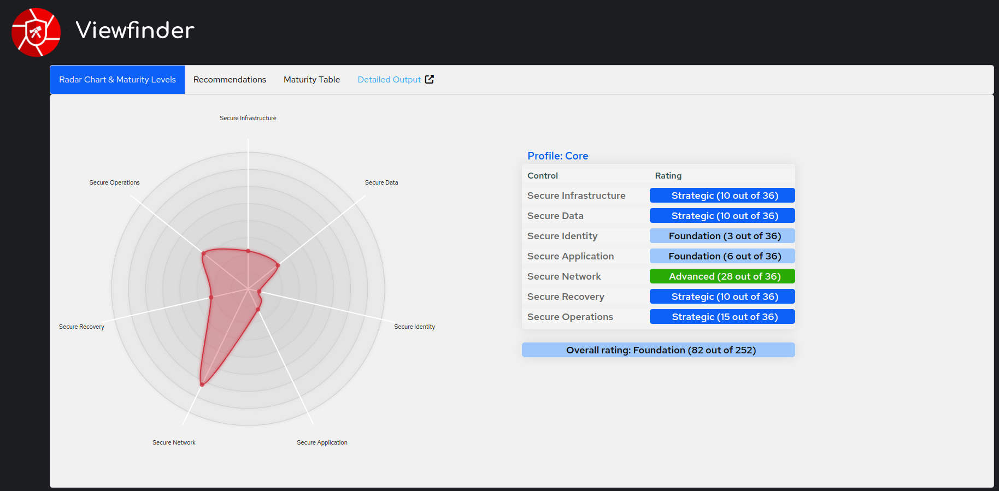
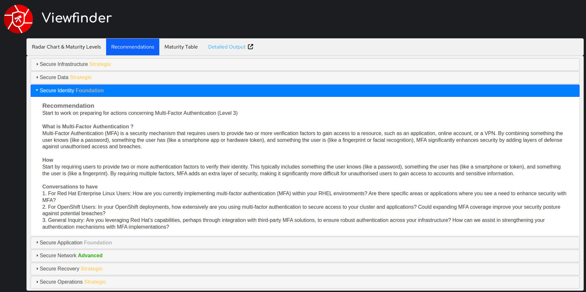
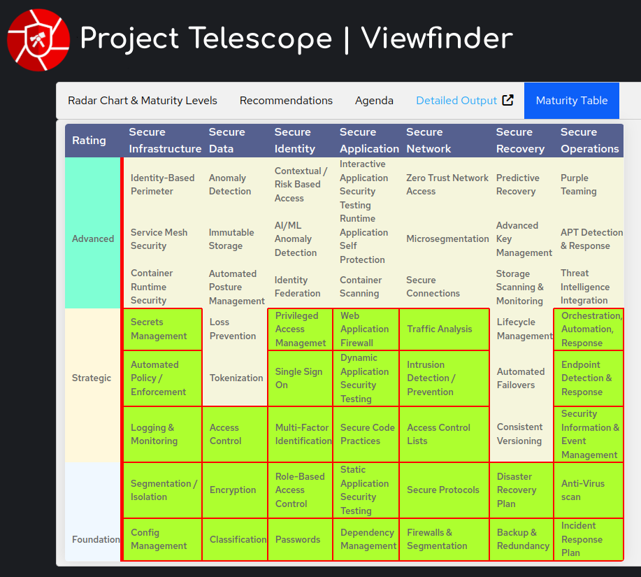

### Description
Viewfinder is a simple web based to tool run a Security Maturity Assessment.
#### Goals
* The primary goal of a Security Maturity Assessment is to understand your security posture by measuring how well it implements, manages, and improves its cybersecurity processes.

* A key objective is to foster resilience — enabling the organization to anticipate, withstand, recover, and evolve in response to security incidents.

* It helps prioritise investments in cybersecurity by highlighting the most critical areas needing attention. It can reveal whether existing controls are effective or if additional resources/solutions are necessary to mitigate risks.

#### Screenshots
##### Main Page

##### Results Page

##### Recommendations

##### Maturity Table

 
### Building

To build the viewfinder application locally you can use Podman or Docker.

Firstly, clone this repo to your local host

``` git clone https://github.com/boogiespook/viewfinder.git ```

The cd to the code directory
``` cd viewfinder ```

You will need to be logged in to the Red Hat Registry (registry.access.redhat.com). 
(this could be optional)

``` podman login registry.access.redhat.com ```

Enter your credentials and you will be able to pull the required images down to build the application.
You can read more about this here: https://access.redhat.com/RegistryAuthentication

Followed by 

``` podman build -t viewfinder:latest . ```

Output will look something like this

```
Getting image source signatures
Checking if image destination supports signatures
Copying blob sha256:0f50e783149b25f84a6a8263a36884e0be54048c3e792b55fa4ba13e93f2b5aa
Copying blob sha256:e584cd196457fe615697ae7bc6c7744519838a1bc718f9c7f04bfccb1d09da71
Copying blob sha256:1153e061da4ea9623b0dcdb9e8638b9432d5aa919217cc7c115b5a858f40f306
Copying blob sha256:4204970c1bfc82b3831e6267e6b670d34071b294bcd078e840f09ed9e3a348b2
Copying config sha256:c0520a77c4c619690f9caa6319623364888f186b100dd3ca217aa289a97ee37a
Writing manifest to image destination
Storing signatures
STEP 2/5: MAINTAINER Chris Jenkins "chrisj@redhat.com"
--> 0d5a5bc5cbc2
STEP 3/5: EXPOSE 8080
--> 23390857b459
STEP 4/5: COPY . /opt/app-root/src
--> 95271e3e5caf
STEP 5/5: CMD /bin/bash -c 'php -S 0.0.0.0:8080'
COMMIT viewfinder:latest
--> deb31fe831fc
Successfully tagged localhost/viewfinder:latest
deb31fe831fcc850e8b8023b693b60de7f470829ffb0fdeb67f6454b259884e5
```

You can verify this by listing the images on your local machine

```podman images```

and you will get an output something like this

``` localhost/viewfinder                    latest      deb31fe831fc  15 minutes ago  928 MB ```

### Running

Once you have the container built you are ready to run the application.

``` podman run -p 8080:8080 localhost/viewfinder ```

If everything is fine you will see a message like this 

``` PHP 8.0.30 Development Server (http://0.0.0.0:8080) started ```

You can then open a browser and visit [https://localhost:8080](https://localhost:8080) to open the main page.

### Pre-built image
If you would just like the image, it's available on quay.io:

``` podman pull quay.io/rhn_gps_cjenkins/viewfinder ```

### Contributing

If you would like to contribute to this project, please feel free to fork the repo.  All PRs are gratefully received!


[](https://scorecard.dev/viewer/?uri=github.com/boogiespook/viewfinder)
